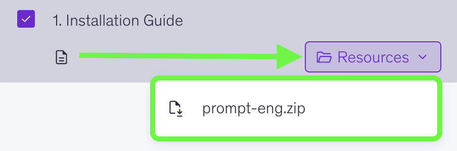
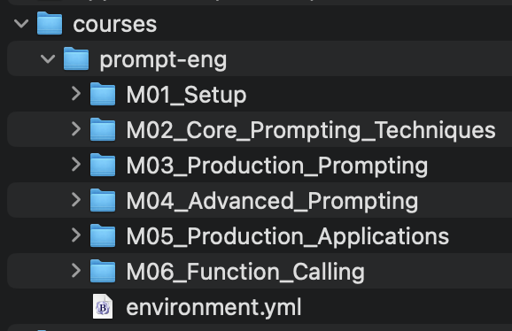

# Prompt Engineering Course Setup Guide

## What We're Setting Up

Before we start, here's what we'll install:

- **Conda**: Manages Python and course tools
- **JupyterLab**: Where you'll write and run AI code (opens in your web browser)
- **OpenAI Python library**: For API calls
  
<br>

## System Requirements

- 🍎 **macOS**: 10.14 or newer
- 🪟 **Windows**: 10 or newer
- 🐧 **Linux**: Ubuntu 18.04+, CentOS 7+, or equivalent
- **Disk Space**: At least 2GB free space
- **Internet**: Required for downloads

<br>

## Before You Begin

**Important**: Follow these steps in order! Each step depends on the previous one.

<br>

## Step 1: Open Your Command Interface

**🍎 macOS - Terminal**:

1. Press `Cmd + Space` to open Spotlight search
2. Type "Terminal"
3. Press Enter

**🪟 Windows - PowerShell**:

1. Press the `Windows key` on your keyboard
2. Type "PowerShell"
3. Press Enter

**🐧 Linux - Terminal**:

1. Press `Ctrl + Alt + T` (most distributions)
2. Or search for "Terminal" in your application menu

<br>

## Step 2: Download Course Materials

Download `prompt-eng.zip` from the Resources tab:



Run the commands below to create a `courses` folder and extract the course files into this folder:


**🍎 macOS & 🐧 Linux**:

```bash
mkdir -p ~/courses

cd ~/courses

unzip ~/Downloads/prompt-eng.zip

cd prompt-eng
```

**🪟 Windows**:

```powershell
cd "$env:USERPROFILE"

mkdir -Force courses

cd courses

Expand-Archive -Path "$env:USERPROFILE\Downloads\prompt-eng.zip" -DestinationPath . -Force

cd prompt-eng
```


**Your folder structure should look like this**:



<br>

## Step 3: Install Conda

Conda installs Python and manages all the libraries we'll need for the course.

**Check if Conda is already installed (all platforms)**:

```bash
conda --version
```

✅ **If you see something like `conda 23.1.0`, skip to Step 4!**


### If Conda is NOT Installed:

**🍎 macOS**:

1. Go to the [Miniconda download page](https://docs.conda.io/en/latest/miniconda.html)
2. **Apple Silicon (M1/M2/M3)**: Download "Miniconda3 macOS Apple M1 64-bit pkg"
3. **Intel Macs**: Download "Miniconda3 macOS Intel x86 64-bit pkg"
4. Double-click downloaded file, follow installation steps
5. Close Terminal completely and reopen it

**🪟 Windows**:

1. Go to the [Miniconda download page](https://docs.conda.io/en/latest/miniconda.html)
2. Download "Miniconda3 Windows 64-bit" installer
3. Run installer, accept defaults until "Advanced Installation Options"
4. **Important**: Check both boxes:
   - ☑️ "Add Miniconda3 to my PATH environment variable" **(Ignore the red "Not Recommended" warning—we need this!)**
   - ☑️ "Register Miniconda3 as my default Python 3.x"
5. Complete installation, close PowerShell completely and reopen it

**🐧 Linux**:

1. Download installer:
   ```bash
   wget https://repo.anaconda.com/miniconda/Miniconda3-latest-Linux-x86_64.sh
   ```
2. Run installer:
   ```bash
   bash Miniconda3-latest-Linux-x86_64.sh
   ```
3. Accept license, choose install location (default is fine)
4. When asked "Do you wish the installer to initialize Miniconda3?", type `yes`
5. Close terminal and reopen it


### ✅ Verify Installation (Everyone)

Before proceeding, close your terminal/PowerShell, reopen it, and run:

```bash
conda --version
```

If you see a version number (e.g., `conda 24.1.2`), you are ready for Step 4!

<br>

## Step 4: Create Your Course Environment

**Navigate to course folder**:

**🍎 macOS & 🐧 Linux**:

```bash
cd ~/courses/prompt-eng
```

**🪟 Windows**:

```powershell
cd "$env:USERPROFILE\courses\prompt-eng"
```

**Create environment (5-15 minutes depending on internet speed)**:

```bash
conda env create -f environment.yml
```

*This installs Python 3.11 and all AI tools. Go grab a coffee!*

**What's being installed?**

- Python 3.11
- OpenAI Python SDK
- JupyterLab
- python-dotenv (for API keys)
- tiktoken (token counting)
- requests (API calls)

**If this fails**: Try `conda clean --all` then run the command again.

**Activate your environment**:

```bash
conda activate prompt-eng
```

**Verify it worked**:

```bash
conda env list
```

✅ You should see `prompt-eng` marked with an asterisk (*). Example output (paths vary by OS):

```
base                     /home/user/miniconda3
prompt-eng            *  /home/user/miniconda3/envs/prompt-eng
```

**Your terminal prompt should also change to**:

```
(prompt-eng) user@computer:~/courses/prompt-eng$
```

<br>

## Step 5: Launch JupyterLab

**Start JupyterLab (all platforms)**:

```bash
jupyter lab
```

### What Should Happen:

- Your web browser should automatically open
- You should see the JupyterLab interface
- If it doesn't open automatically, look for a link like `http://localhost:8888/lab` in the terminal and **click the link**, or **copy and paste** it into your browser.

<br>

## 📍 What's Next

In the next two videos, you'll:

1. **M01A**: Verify your Python environment and packages
2. **M01B**: Create your OpenAI API key and `.env` file

<br>

## 🔁 Daily Routine: How to Start Working

**Every time you want to work on the course**:

**🍎 macOS & 🐧 Linux**:

```bash
cd ~/courses/prompt-eng
conda activate prompt-eng
jupyter lab
```

**🪟 Windows**:

```powershell
cd "$env:USERPROFILE\courses\prompt-eng"
conda activate prompt-eng
jupyter lab
```

**Note**: If you see "Module not found" errors, you likely forgot to run `conda activate prompt-eng`!

**When finished**:

- Close browser tab
- In terminal, press `Ctrl + C` twice to stop JupyterLab
- Type `conda deactivate` to exit the environment
- Type `exit` to close terminal

<br>

## 🔧 Troubleshooting

### "Command not found" / "not recognized" errors

- Make sure you've activated your environment: `conda activate prompt-eng`
- Close terminal/PowerShell completely and reopen it
- Restart your computer

### Environment creation failed

- Run: `conda clean --all` then try again
- Check disk space (2GB+) and internet connection
- **🪟 Windows**: Disable antivirus temporarily if installation hangs

### Conda activate doesn't work

- Close terminal and reopen it
- Run `conda init powershell` (Windows) or `conda init bash` (macOS/Linux)
- Close and reopen terminal again, then retry `conda activate prompt-eng`

### JupyterLab won't start

- Ensure environment is active (you should see `(prompt-eng)` in your prompt)
- Check no other Jupyter instances are running
- **Port busy?** Try running: `jupyter lab --port=8889`

### Wrong kernel in JupyterLab

- In JupyterLab: "Kernel" → "Change Kernel" → "Python 3 (ipykernel)"

### Import errors for libraries

- Ensure environment is activated: `conda activate prompt-eng`
- Restart Jupyter: Close browser, `Ctrl + C` in terminal, then `jupyter lab` again

### Platform-Specific Issues

**🪟 Windows**:

- **Permission errors**: Try running PowerShell as Administrator
- **Path issues**: Your files are in `C:\Users\YourName\courses\prompt-eng`

**🐧 Linux**:

- **Permission errors**: Avoid using `sudo` with conda commands
- **Missing packages**: Install build tools: `sudo apt install build-essential` (Ubuntu)

**🍎 macOS**:

- **Xcode issues**: Run `xcode-select --install` if you get compiler errors
- **Chip confusion**: Use Activity Monitor to check if you have Intel or Apple Silicon

### Still stuck?

Don't worry! Programming setup can be tricky. Common fixes:

1. Restart your computer
2. Make sure you followed each step in order
3. Copy the error message and paste it into ChatGPT or Claude—they're great at debugging setup issues
